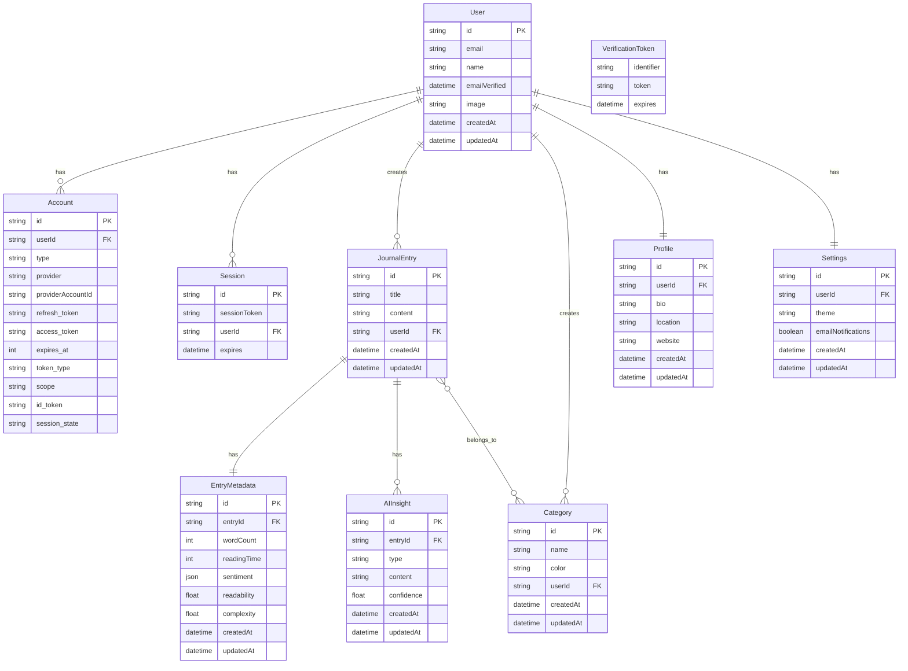

# Database Entity Relationship Diagram

```mermaid
erDiagram
    User {
        string id PK
        string email
        string name
        datetime emailVerified
        string image
        datetime createdAt
        datetime updatedAt
    }
    Account {
        string id PK
        string userId FK
        string type
        string provider
        string providerAccountId
        string refresh_token
        string access_token
        int expires_at
        string token_type
        string scope
        string id_token
        string session_state
    }
    Session {
        string id PK
        string sessionToken
        string userId FK
        datetime expires
    }
    VerificationToken {
        string identifier
        string token
        datetime expires
    }
    JournalEntry {
        string id PK
        string title
        string content
        string userId FK
        datetime createdAt
        datetime updatedAt
    }
    Category {
        string id PK
        string name
        string color
        string userId FK
        datetime createdAt
        datetime updatedAt
    }
    Profile {
        string id PK
        string userId FK
        string bio
        string location
        string website
        datetime createdAt
        datetime updatedAt
    }
    Settings {
        string id PK
        string userId FK
        string theme
        boolean emailNotifications
        datetime createdAt
        datetime updatedAt
    }
    EntryMetadata {
        string id PK
        string entryId FK
        int wordCount
        int readingTime
        json sentiment
        float readability
        float complexity
        datetime createdAt
        datetime updatedAt
    }
    AIInsight {
        string id PK
        string entryId FK
        string type
        string content
        float confidence
        datetime createdAt
        datetime updatedAt
    }

    User ||--o{ Account : has
    User ||--o{ Session : has
    User ||--o{ JournalEntry : creates
    User ||--o{ Category : creates
    User ||--|| Profile : has
    User ||--|| Settings : has
    JournalEntry ||--|| EntryMetadata : has
    JournalEntry ||--o{ AIInsight : has
    JournalEntry }o--o{ Category : belongs_to
``` 