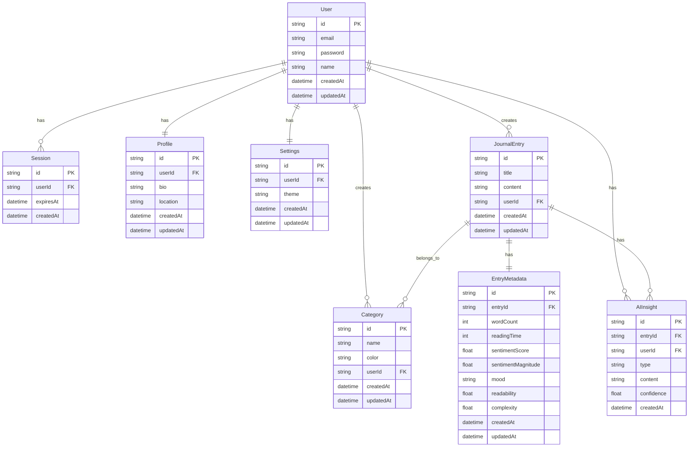

# Shamiri Journal System Design

## Overview

Shamiri Journal is a modern journaling application that combines traditional journaling with AI-powered features to enhance the user's writing experience. The system is designed to be scalable, maintainable, and user-friendly while providing advanced features like sentiment analysis, writing style analysis, and AI-generated insights.

## Architecture

### Technology Stack

- **Frontend**: Next.js 14 with App Router, React, TailwindCSS
- **Backend**: Next.js API Routes
- **Database**: PostgreSQL with Prisma ORM
- **Authentication**: NextAuth.js with JWT
- **AI/ML**: 
  - Natural.js for text analysis
  - Hugging Face for AI insights generation
- **Deployment**: Fly.io
- **Testing**: Jest, React Testing Library
- **Documentation**: Swagger/OpenAPI

### System Components

1. **Frontend Application**
   - Next.js App Router for routing
   - React components for UI
   - TailwindCSS for styling
   - Client-side state management
   - Responsive design

2. **Backend Services**
   - Next.js API Routes
   - Authentication middleware
   - Database operations
   - AI/ML services
   - Rate limiting
   - Error handling

3. **Database Layer**
   - PostgreSQL database
   - Prisma ORM for database operations
   - Database migrations
   - Connection pooling
   - Query optimization

4. **AI/ML Services**
   - Text analysis service
   - Sentiment analysis
   - Writing style analysis
   - AI insights generation
   - Theme detection
   - Pattern recognition

5. **Authentication System**
   - NextAuth.js integration
   - JWT token management
   - Session handling
   - Password hashing
   - Security middleware

## Database Schema

### Database Diagram



### Core Models

1. **User**
   ```prisma
   model User {
     id        String   @id @default(cuid())
     email     String   @unique
     password  String
     name      String?
     createdAt DateTime @default(now())
     updatedAt DateTime @updatedAt
     sessions  Session[]
     profile   Profile?
     settings  Settings?
     categories Category[]
     entries   JournalEntry[]
     insights  AIInsight[]
   }
   ```

2. **Session**
   ```prisma
   model Session {
     id        String   @id @default(cuid())
     userId    String
     expiresAt DateTime
     createdAt DateTime @default(now())
     user      User     @relation(fields: [userId], references: [id])
   }
   ```

3. **Profile**
   ```prisma
   model Profile {
     id        String   @id @default(cuid())
     userId    String   @unique
     bio       String?
     location  String?
     createdAt DateTime @default(now())
     updatedAt DateTime @updatedAt
     user      User     @relation(fields: [userId], references: [id])
   }
   ```

4. **Settings**
   ```prisma
   model Settings {
     id        String   @id @default(cuid())
     userId    String   @unique
     theme     String   @default("light")
     createdAt DateTime @default(now())
     updatedAt DateTime @updatedAt
     user      User     @relation(fields: [userId], references: [id])
   }
   ```

### Journal Models

1. **Category**
   ```prisma
   model Category {
     id        String   @id @default(cuid())
     name      String
     color     String
     userId    String
     createdAt DateTime @default(now())
     updatedAt DateTime @updatedAt
     user      User     @relation(fields: [userId], references: [id])
     entries   JournalEntry[]
   }
   ```

2. **JournalEntry**
   ```prisma
   model JournalEntry {
     id        String   @id @default(cuid())
     title     String
     content   String
     userId    String
     createdAt DateTime @default(now())
     updatedAt DateTime @updatedAt
     user      User     @relation(fields: [userId], references: [id])
     categories Category[]
     metadata  EntryMetadata?
     insights  AIInsight[]
   }
   ```

3. **EntryMetadata**
   ```prisma
   model EntryMetadata {
     id              String   @id @default(cuid())
     entryId         String   @unique
     wordCount       Int
     readingTime     Int
     sentimentScore  Float?
     sentimentMagnitude Float?
     mood            String?
     readability     Float?
     complexity      Float?
     entry           JournalEntry @relation(fields: [entryId], references: [id])
   }
   ```

### AI Models

1. **AIInsight**
   ```prisma
   model AIInsight {
     id        String   @id @default(cuid())
     entryId   String
     userId    String
     type      String   // theme, pattern, recommendation
     content   String
     confidence Float
     createdAt DateTime @default(now())
     entry     JournalEntry @relation(fields: [entryId], references: [id])
     user      User     @relation(fields: [userId], references: [id])
   }
   ```

## API Design

### Authentication Endpoints

1. **Register**
   - POST `/api/v1/auth/register`
   - Request: email, password, name
   - Response: user data

2. **Login**
   - POST `/api/v1/auth/login`
   - Request: email, password
   - Response: user data, token

3. **Get Current User**
   - GET `/api/v1/auth/me`
   - Response: user data with profile and settings

### Journal Entry Endpoints

1. **List Entries**
   - GET `/api/v1/entries`
   - Query params: page, pageSize, categoryId, startDate, endDate, search
   - Response: paginated entries with metadata

2. **Create Entry**
   - POST `/api/v1/entries`
   - Request: title, content, categoryIds
   - Response: created entry with metadata

3. **Get Entry**
   - GET `/api/v1/entries/{id}`
   - Response: entry with metadata and insights

4. **Update Entry**
   - PUT `/api/v1/entries/{id}`
   - Request: title, content, categoryIds
   - Response: updated entry

5. **Delete Entry**
   - DELETE `/api/v1/entries/{id}`
   - Response: success message

### Category Endpoints

1. **List Categories**
   - GET `/api/v1/categories`
   - Response: user's categories

2. **Create Category**
   - POST `/api/v1/categories`
   - Request: name, color
   - Response: created category

3. **Update Category**
   - PUT `/api/v1/categories/{id}`
   - Request: name, color
   - Response: updated category

4. **Delete Category**
   - DELETE `/api/v1/categories/{id}`
   - Response: success message

### AI Feature Endpoints

1. **Text Analysis**
   - POST `/api/v1/analyze/text`
   - Request: content
   - Response: suggestions, auto-completions, writing style analysis

2. **Generate Entry Insights**
   - POST `/api/v1/entries/{entryId}/insights`
   - Response: generated insights

3. **Get Entry Insights**
   - GET `/api/v1/entries/{entryId}/insights`
   - Response: entry's insights

4. **List User Insights**
   - GET `/api/v1/insights`
   - Query params: type, timeRange
   - Response: filtered insights

5. **Delete Insight**
   - DELETE `/api/v1/insights/{insightId}`
   - Response: success message

### Analytics Endpoints

1. **Get User Analytics**
   - GET `/api/v1/analytics`
   - Response: writing statistics, trends, and patterns

## Security Considerations

1. **Authentication**
   - JWT-based authentication
   - Secure password hashing
   - Session management
   - Rate limiting

2. **Data Protection**
   - Input validation
   - SQL injection prevention
   - XSS protection
   - CSRF protection

3. **API Security**
   - HTTPS enforcement
   - Request validation
   - Error handling
   - Rate limiting

## Performance Optimization

1. **Database**
   - Indexed queries
   - Connection pooling
   - Query optimization
   - Caching strategies

2. **API**
   - Response compression
   - Caching headers
   - Pagination
   - Rate limiting

3. **Frontend**
   - Code splitting
   - Image optimization
   - Lazy loading
   - Client-side caching

## Monitoring and Logging

1. **Application Monitoring**
   - Error tracking
   - Performance metrics
   - User analytics
   - System health

2. **Logging**
   - Error logging
   - Access logging
   - Audit logging
   - Performance logging

## Deployment Strategy

1. **Infrastructure**
   - Fly.io deployment
   - Database hosting
   - CDN integration
   - SSL/TLS configuration

2. **CI/CD**
   - Automated testing
   - Build process
   - Deployment pipeline
   - Rollback procedures

3. **Scaling**
   - Horizontal scaling
   - Load balancing
   - Database scaling
   - Cache distribution

## Future Considerations

1. **Feature Expansion**
   - Mobile application
   - Offline support
   - Rich text editor
   - Media attachments

2. **AI Enhancements**
   - Advanced sentiment analysis
   - Personalized recommendations
   - Writing style improvement
   - Content summarization

3. **Integration**
   - Calendar integration
   - Social sharing
   - Export/Import
   - Third-party services

## Development Guidelines

1. **Code Style**
   - TypeScript strict mode
   - ESLint configuration
   - Prettier formatting
   - Git hooks

2. **Testing**
   - Unit tests
   - Integration tests
   - E2E tests
   - Performance tests

3. **Documentation**
   - API documentation
   - Code documentation
   - Deployment guides
   - User guides 